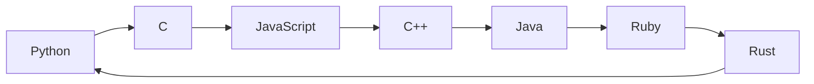

# 7 Languages Quine Relay

7개의 프로그래밍 언어를 거쳐 최종적으로 다시 자기 자신으로 돌아오는 **콰인 릴레이(Quine Relay)** 구현체입니다.

## 실행 흐름

## 실행 및 검증
1. Python -> C  
    ```python3 quine_relay.py > relay.c```
1. C -> JS  
    ```gcc relay.c -o relay_c && ./relay_c > relay.js```
1. JS -> C++  
    ```node relay.js > relay.cpp```
1. C++ -> Java  
    ```g++ relay.cpp -o relay_cpp && ./relay_cpp > Main.java```
1. Java -> Ruby  
    ```javac Main.java && java Main > relay.rb```
1. Ruby -> Rust  
    ```ruby relay.rb > relay.rs```
1. Rust -> Python  
    ```rustc relay.rs -o relay_rust && ./relay_rust > reconstructed.py```
1. 검증
    ```diff quine_relay.py reconstructed.py```
